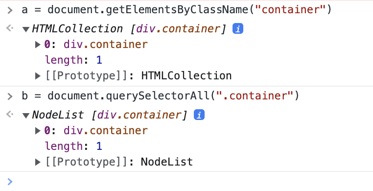
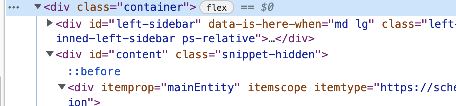
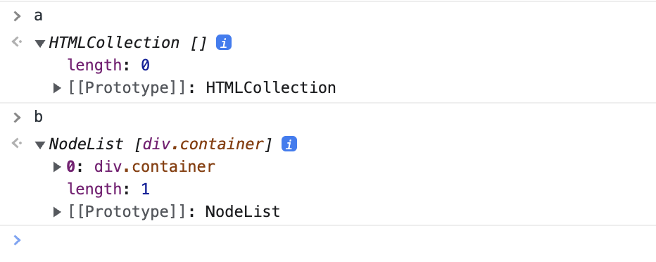
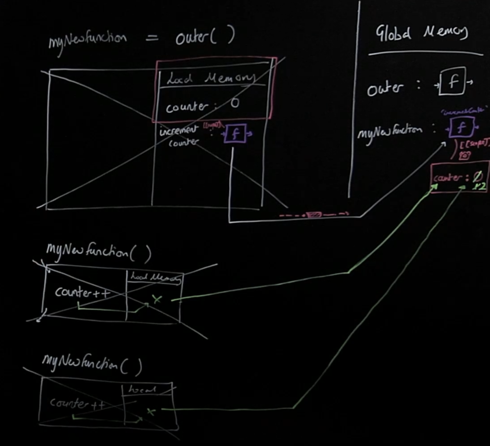
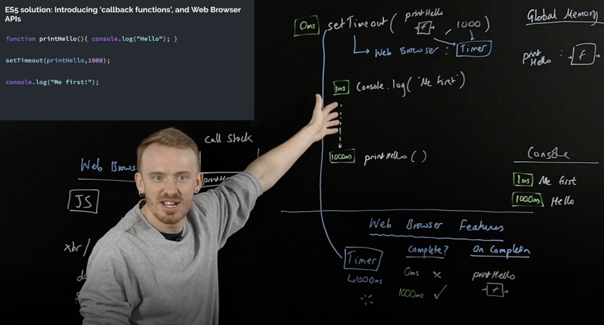

Goal: 2 months to complete

# Learning Path

1. [Complete Intro to Web Development, v3](https://frontendmasters.com/courses/web-development-v3/)<br>
   [Codes](https://github.com/phvvap/frontendmasters-codes/tree/main/1-web-development-v3)<br>
2. [JavaScript: First Steps](https://frontendmasters.com/courses/javascript-first-steps/)<br>
   [Codes](https://github.com/phvvap/frontendmasters-codes/tree/main/2-javascript-first-steps)<br>
3. [JavaScript: The Hard Parts, v2](https://frontendmasters.com/courses/javascript-hard-parts-v2/) <br> [Codes](https://github.com/phvvap/frontendmasters-codes/tree/main/3-javascript-hard-parts-v2)
4. [Deep JavaScript Foundations, v3](https://frontendmasters.com/courses/deep-javascript-v3/)
5. [Functional JavaScript First Steps](https://frontendmasters.com/courses/functional-first-steps/)
6. [JavaScript: The Recent Parts](https://frontendmasters.com/courses/js-recent-parts/)
7. [JavaScript: The New Hard Parts](https://frontendmasters.com/courses/javascript-new-hard-parts/)
8. [Complete Intro to React, v7](https://frontendmasters.com/courses/complete-react-v7/)
9. [Intermediate React, v4](https://frontendmasters.com/courses/intermediate-react-v4/)
10. [State Management in Pure React, v2](https://frontendmasters.com/courses/pure-react-state/)
11. [TypeScript Fundamentals, v3](https://frontendmasters.com/courses/typescript-v3/)
12. [Intermediate TypeScript](https://frontendmasters.com/courses/intermediate-typescript/)
13. [React and TypeScript](https://frontendmasters.com/courses/react-typescript/)
14. [Redux Fundamentals (feat. React)](https://frontendmasters.com/courses/redux-fundamentals/)
15. [Complete Intro to Computer Science](https://frontendmasters.com/courses/computer-science-v2/)
16. [The Last Algorithms Course You'll Need](https://frontendmasters.com/courses/algorithms/)

# Notes

- [JavaScript: First Steps](#javascript-first-steps)
- [JavaScript: The Hard Parts](#javascript-the-hard-parts)

# JavaScript: First Steps

## Difference between HTML DOM Document `getElementsByClassName()` and `querySelectorAll()`

- `getElementsByClassName`

  - `getElementsByClassName` returns a `HTMLCollection` and it is **live** - which is updated when the DOM changes.
  - Time complexity is O(1)

- `querySelectorAll`
  - `querySelectorAll` returns a `NodeList` and it is **not live** - so changing the DOM doesn't affect it.
  - Time complexity is O(n)

## You will got this by looking at the example below:

Firstly, I create two variables called `a` - using `getElementsByClassName` and `b` using `querySelectorAll`

Then I delete the div has `container` class

After that, I check value of `a` and `b`


## Diffderence between `innerText` and `textContent`

- `innerText` returns the **visible** text contained in a node, while `textContent` returns the full text. For example, on the following code:

```html
<span>Hello <span style="display: none">World</span></span>
```

`innerText` will return `'Hello'`, while `textContent` will return `'Hello World'`

- As a result, innerText is much more performance-heavy: it requires layout information to return the result.

- `innerText` will turn `<br>` elements into newline characters, while `textContent` will just ignore them

- If you change the `text-transform` of an element by CSS, it will affect the result of `innerText`, but not the result of `textContent`.

For example:

```html
<div style="text-transform: uppercase;">Hello World</div>
```

`innerText` will be `"HELLO WORLD"`, while `textContent` will be `"Hello World"`.

For [more information](https://developer.mozilla.org/en-US/docs/Web/API/Node/textContent)

## Difference between Parameters vs Arguments in JavaScript

**Parameter** is declared inside the function header. Parameters's values is unknown until we call the function.

> **Note**: Parameters can only accessed inside function scope

**Argument** is the value that we pass into the function. When we call a function, _arguments_ we pass in will be value of the corresponding _parameters_.

## fetch && Promises

Imagine you fetch an API and you see `Promise {<state>: "pending}`, JS said: I promise I'm gonna get you this value but I don't have it yet. `Promise` is a construct in JS that lets represent a value that we don't have yet (take a while to get the value).

`Promise` can be in 3 possible states:

- `pending`: still waiting for the value
- `fulfilled` (resolved): finally got the value, all done
- `rejected`: sorry couldn't get the value, all done

It takes time for Promises to resolve, so they are "asynchronous".

But our program needs the data, we want JS to stop and wait for the `Promise` to resolve.

`await` lets us tell JS to stop and wait for an asynchronous operation to finish.

`async function` tells JS to expect to `await` async operations inside the function

> Notes: When we create a script like this `<script type="module"> </script>`, we can use `await` in there, but this will create its `own scope`, it means we can't access variables inside of this in another scope (like console on browser). Between

## import && export

`export` lets us expose variables from our module's scope to the outside world

```javascript
// myModule.js
const veryUsefulFunction = () => "I came from a module";
export { veryUsefulFunction };
```

`import` lets us use an exposed variable from another module

```javascript
// myModule.js
import { veryUsefulFunction } from "./myModule.js";
veryUsefulFunction();
```

## Browser Debugger

You can also use the browser's debugger to _pause_ JS and inspect what's happening

```javascript
function whyIsntThisWorking(input) {
  debugger;
  return thingThatDoesntWork(input);
}
```

The `debugger` statement creates a _breakpoint_ where JS will pause and let you look around.

# JavaScript: The Hard Parts

## Principles

- Goes through our code, line by line and does each of the line of code, they call this the **`thread of execution`**. It threads its way down and executes.

- Saves 'data' like strings and arrays so we can use that data later - in its **`memory`**
  <br>We can even save code ('function')

- **`Functions`**:
  Code we save ('define') functions & can use (call/invoke/execute/run) later with the function's name & ()

- **`Execution context `**: Created to run the code of a function - has 2 parts:

  - Thread of execution
  - Memory

- **`Call stack`**:
  - JS keeps track of what function is currently running (where's the `thread of execution`)
  - Run a function - add to `call stack`
  - Finish running the function - JS removes it from `callstack`
  - Whatever is top of the `call stack` - that's the function we're currently running<br><br>
    Example: When we execute a function and execute another function inside of that function, we add it into the call stack, finish the **inside function** then go back to the **function**, then go to the `global()` - which is always at the end of the `call stack`.

## Functions & Callbacks

The _outer function_ that **takes in** a function is our `higher-order function`

The function we insert is our `callback function`

Callbacks and Higher order functions simplify our code and keep it `DRY`

- **Declarative readable code**: Map, filter, reduce - the most readable way to write code to work with data
- **Asynchronous JavaScript**: Callbacks are a core aspect of async JS, and are under-the-hood of promises, async/await

## Closure

- Closure is the most estoteric of JS concepts
- Enables powerful pro-levle functions like 'once' and 'memoize'
- Many JS design patterns including the module pattern use closure
- Build iterators, handle partial application and maintain state in an synchronous world

### Functions with memories

- When our functions get called, we create a live store of data (local memory/ variable environment/state) for that function's execution context.
- when the function finishes executing, its local memory is deleted (except the returned value)
- But what if our functions could hold on to live data between executions?
- This would let our function definitions have an associated cache/persistent memory
- But it all starts with us **returning a function from another function**

### Retaining Function Memory

```javascript
function outer() {
  let counter = 0;
  function incrementCounter() {
    counter++;
  }
  return incrementCounter;
}
const myNewFunction = outer();
myNewFunction();
myNewFunction();
```

When we assign `outer` function to `myNewFunction`, it took that `incrementCounter` function definition and it will grab its surrounding data, and attached it onto to the function definition.

### Function Closure

In the code above, when we call `myNewFunction()` the first time, it willl go to the global memory and find `counter` variable in `myNewFunction` because like we said, not just the function definition but all its surrounding data goes with it.
We increase `counter` so its value is `1`.
After that, we call `myNewFunction()` again, it will do exactly same as the first time we call it, and we increase the value of `counter` by 1, so its value now is `2`



Imagine we have a hidden property `[[scope]]` - that links to all the surrounding data of the `incrementCounter` function definition that goes along with the `myNewFunction`, and we can just only access the surrounding data by running the function `myNewFunction`.

> Notes: If we have another variable inside `outer()` function, let's say `let justAVar = 5`, when we grab the data along with the function definition, JavaScript will notice if `justAVar` appears inside that function definition (see if it is reference by the function). And if it is not, JavaScript will not grab it along with the function definition.

We call the data surrounding that function definition `backpack`

**Individual backpacks** <br>
If we run '`outer`' again and store the returned '`incrementCounter`' function
definition in '`anotherFunction`', this new `incrementCounter` function was created in
a **new execution context** and therefore has a brand new **independent backpack**

### Why use const and when to use let in for...of loops?

If there are no assignments to the identifier within the loop body, it's a matter of style whether you use `let` or `const`.

- Use `const` if you want the identifier within the loop body to be read-only (so that, for instance, if someone modifies the code later to add an assignment, it's a proactive error).
- Use `let` if you want to be able to assign to it (because you have an assignment in your code, or you want someone to be able to add one later without changing the declaration).

### Web Browser APIs Example - setTimeout



### Callbacks Queue & Event Loop

All regular code will run first, then check the call stack if it is empty, if it is empty we put thing out of the `callbacks queue` - means we go to the callbacks queue and grab the function then put to the call stack. And if the call stack is still not empty, there's still global code to run, then I will not even go to look at the `callbacks queue`.
